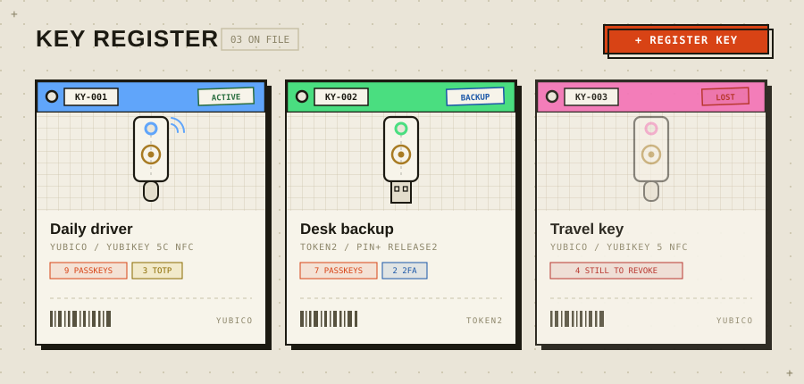

<div align="center">


# Keeyo

**The self-hosted equipment register for your hardware security keys.**

[](https://github.com/ans-ib/keeyo/tags)
[](LICENSE)
[](https://nodejs.org)
[](https://github.com/ans-ib/keeyo/releases)
[](https://github.com/ans-ib/keeyo/actions)
[](https://github.com/ans-ib/keeyo/pkgs/container/keeyo)
[](https://github.com/ans-ib/keeyo/stargazers)

</div>

If you're anything like me, you probably bought a YubiKey, got a couple of Token2 keys a bit later, and now you have absolutely no idea which key holds which passkey or which one has your GitHub TOTP. Keeyo fixes this: every physical key gets a digital asset tag, and every tag lists exactly what lives on it.

To be super clear upfront: **this app only stores names and notes.** No TOTP seeds, no private keys, no secrets — all the sensitive stuff stays on your hardware keys where it belongs.

##  Documentation

Full documentation is available at **[ans-ib.github.io/keeyo](https://ans-ib.github.io/keeyo/)**:

- [Overview](https://ans-ib.github.io/keeyo/) — what it does and why
- [Installation](https://ans-ib.github.io/keeyo/install.html) — Docker, Compose, bare Node, reverse proxy, every env var
- [User guide](https://ans-ib.github.io/keeyo/guide.html) — scanning, coverage, lost keys, secret notes, printing
- [Security model](https://ans-ib.github.io/keeyo/security.html) — what's protected, how, and the honest limits

<div align="center">

</div>

##  Quick start

```bash
docker run -d --name keeyo \
  -p 5390:5390 \
  -v keeyo-data:/data \
  --restart unless-stopped \
  ghcr.io/ans-ib/keeyo:latest
```

Open `http://localhost:5390` — your first visit creates the admin account. Prefer Compose or bare Node? See the [install docs](https://ans-ib.github.io/keeyo/install.html).

```yaml
services:
  keeyo:
    image: ghcr.io/ans-ib/keeyo:latest
    container_name: keeyo
    restart: unless-stopped
    ports:
      - "5390:5390"
    volumes:
      - keeyo-data:/data

volumes:
  keeyo-data:
```

##  Key features

- **Visual inventory** — a grid of asset-tag cards: color strips, tag numbers, status stamps (active / backup / lost / retired), schematic key artwork or your own photos.
- **Scan to detect** — plug a key in, tap it, and Keeyo reads its fingerprint via WebAuthn and fills in vendor/model from the live FIDO registry (auto-updating, so new keys are recognized without app updates).
- **"Which key is this?"** — found a random key in a drawer? Identify it with one tap. Several keys plugged in at once is fine: the one you touch answers.
- **Track what goes where** — every passkey, 2FA registration and TOTP per key, plus the reverse lookup per service.
- **Backup warnings** — services relying on a single key get flagged, and the warning is a button that registers a backup in two clicks.
- **Lost-key checklist** — mark a key lost and get a revocation checklist of every service that still trusts it.
- **Tap-to-reveal secret notes** — store a key's PIN so it's revealed only by physically tapping that exact key (verified server-side). On PRF-capable keys the note is **end-to-end encrypted** with a key derived from the hardware itself — the server stores ciphertext only.
- **Sign-in 2FA** — protect Keeyo itself with a hardware key, an authenticator app (TOTP), or both — plus single-use recovery codes so a lost second factor never locks you out.
- **Health check-ins & logbook** — "tested" stamps with 6-month staleness nudges, and an append-only per-key history.
- **Print it** — physical asset tags (barcode + QR) and a full printable register sheet; CSV export too.
- **The basics** — search, filters, keyboard shortcuts, undo on deletes, multi-user, two selectable design languages (the industrial *Register* look or a calm *Soft* mode) × five color schemes, JSON backups, installable PWA with offline reading.

##  Security

Scrypt-hashed passwords, server-side sessions, strict CSP, full server-side WebAuthn verification, and spoof-proof rate limiting. Read the [security model](https://ans-ib.github.io/keeyo/security.html) — including the honest limitations — and see [SECURITY.md](SECURITY.md) for reporting vulnerabilities.

## 🛠 Tech

Node.js + Express + SQLite (Node's built-in — zero native modules), vanilla JS frontend, no build step, one tiny container. The server's only outbound request is the FIDO device-registry refresh, and `KEEYO_OFFLINE=1` turns even that off.

##  Support & community

Questions, ideas, or want to show off your key register? Head to [**GitHub Discussions**](https://github.com/ans-ib/keeyo/discussions) — Q&A for setup help, Ideas for feature requests, Show and tell for your setups. Bugs go in [Issues](https://github.com/ans-ib/keeyo/issues); security problems go through the [private reporting flow](SECURITY.md), never public threads.

##  Contributing

Issues and PRs are welcome — especially additions to the device catalog (`public/models.js`) and real-world testing with keys I don't own. Run the test suite with `npm test`.

##  License

[AGPL-3.0](LICENSE)
